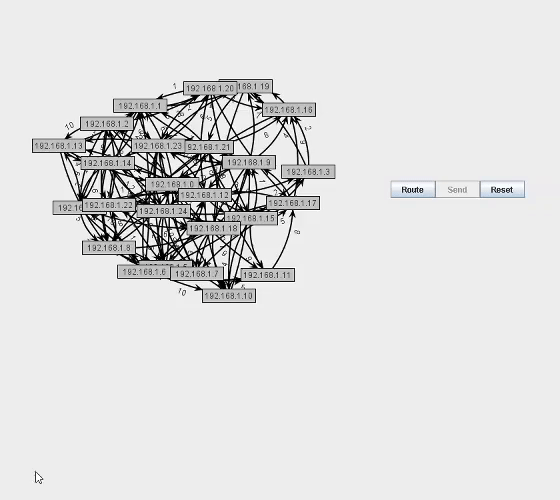

# Computer-Network-Sim
This was the final project for my data structures class in which I recode different structures in Java such as Hashmaps, Linked list, Arraylists to implementing Dkistras Algorithm. The main goal was to have different nodes(vertices) be able to communcate with one another via "Network" connections in which the shorts path is picked.
# Original Rep.
https://github.com/gildir/CS310_p4_Fall19
# Testing via command prompt
To visual the network, you put the given files into a single directory, then using the command line below to complie: 
```
javac -cp .;310libs.jar *.java
```
Then run the SIMGUI class:
```
java -cp .;310libs.jar SIMGUI
```
To change the amount vertices/networks(Max is 250) generated you can follow the above command with an postive integer and to change the chance of a connection happing between a network type a number after amount of networks between 0-1 in decimal.
```
java -cp .;310libs.jar SIMGUI 50 0.25
```
Here is short gif simulation :


